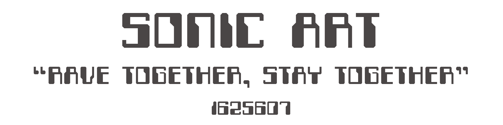

Since the start of human history, we have had music ingrained into our very DNA.<a href="https://futurism.com/is-music-in-our-dna"> It's part of what makes us human.</a> There have been countless changes to what we consider music, and a multitude of genres have evolved with us over the years. We are part of the century that has seen the most technological change to the way we make music, with electricity becoming one of the most popular mediums of sound creation. Concert halls that once played host to orchestras and musicians have fallen out of popularity, replaced by dark clubs full of every form of human expression, where a lone human is responsible for the ebb and flow of the crowd in front of them. Our primal self is still being unleashed to the pulse of music, but in a way that matches the technological progress we have made. The instruments of old have been replaced by sub-bass, complex synthesizers and mechanically relentless drum machines that lay a beat with precision no drummer could attain.

House. Techno. Rave.

These genres have become the anthem of the masses, who make a pilgrimage to their club of choice every weekend. Some are sober, some choose to enhance their night. It doesn’t matter when we’re all under one roof raving. The soundscape I have created is titled "Rave Together, Stay Together", and is a portrayal of the emotions felt throughout a night in a club, from the highs to the lows. It consists of three parts, Come-up, Plateau and Comedown. The Come-Up is a cheerful tale of anticipation, walking down the street, headphones in, fresh out of work with a bag of cans by your side, ready to see what the night brings. The plateau is a darker tale, with pounding sub bass and sounds of the night echoing throughout, eventually peaking with the repeating rave stab piano motif seeing the night to its end. The comedown, a heartful reflection of the night is tinged with melancholy.  The comedown features interviews I have recorded with friends, describing their love for raving and what draws them to the music and culture. The comedown section also features field recordings of birds that will juxtapose the electronically created sounds that appear throughout, and ultimately end the soundscape as a fanfare for the night's demise, a sound any early morning raver will recognise.  This soundscape will portray the love for raving that is still present within not only me and my friends, but across the world many years after rave’s ‘heyday’.

  

<iframe src="https://www.youtube.com/embed/eZVSrB9V5wQ" style="border: 0; top: 0; left: 0; width: 100%; height: 100%; position: absolute;" allowfullscreen="" scrolling="no"></iframe>

